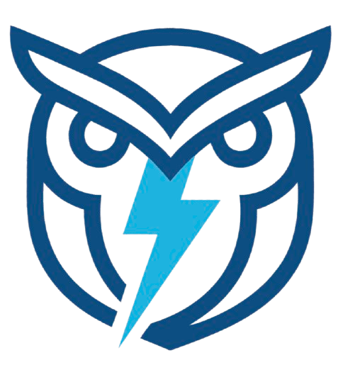

<p align="center">
  
</p>

# TypeOwl Example Backend

A Fastify API server demonstrating **all four ways** to define API types with TypeOwl.

## Setup

```bash
npm install
npm run dev
```

The server starts on `http://localhost:3001`.

## Four Ways to Define Types

| Option | Approach | Best For |
|--------|----------|----------|
| 🔵 **route.get()** ⭐ | Multi-framework + Zod | **Recommended** |
| 🟡 Static Types | Extract from `src/types/` | Simple type sharing, no validation |
| 🟢 typeowl.endpoint() | Framework-specific + Zod | Quick setup with one framework |
| 🔴 Raw Handlers | No TypeOwl | Endpoints not exposed to frontend |

## API Endpoints

| Method | Path | Description | Type Definition |
|--------|------|-------------|-----------------|
| GET | `/api/blogs` | List all blogs | route.get() |
| GET | `/api/blogs/:id` | Get blog by ID | route.get() |
| POST | `/api/blogs` | Create a blog | route.get() |
| GET | `/api/products` | List/search products | route.get() |
| GET | `/api/products/:id` | Get product by ID | route.get() |
| GET | `/api/users` | List all users | route.get() |
| GET | `/api/users/:id` | Get user by ID | route.get() |
| POST | `/api/users` | Create a user | route.get() |
| DELETE | `/api/users/:id` | Delete a user | route.get() |
| GET | `/api/health` | Health check | Raw (no TypeOwl) |

## TypeOwl Endpoints

| Path | Description |
|------|-------------|
| `/__typeowl` | JSON manifest (metadata + file pointers) |
| `/__typeowl/types/content.d.ts` | Extracted types (Blog, Product) |

## How It Works

### ⭐ route.get() — Recommended (Framework-Agnostic)

```typescript
import { z } from 'zod';
import { initTypeOwl, route } from 'typeowl/server';

// Define Zod schemas
const UserSchema = z.object({
  id: z.string(),
  email: z.string().email(),
  name: z.string(),
});

// Define routes (framework-agnostic!)
const getUsers = route.get('/api/users')
  .returns(z.array(UserSchema));

const createUser = route.post('/api/users')
  .withBody(CreateUserSchema)
  .returns(UserSchema);

// Wire up with your framework (Fastify, Express, Hono, Next.js, Koa)
app.get(getUsers.path, async () => {
  return getUsers.response(users);
});

app.post(createUser.path, async (request, reply) => {
  const input = createUser.body(request.body);  // Validates with Zod!
  return createUser.response(newUser);
});
```

### typeowl.endpoint() — Framework-Specific Alternative

```typescript
import { initTypeOwl } from 'typeowl/server';
import { z } from 'zod';

const typeowl = await initTypeOwl();

typeowl.endpoint(app, 'GET', '/api/users', {
  response: z.array(UserSchema),
}, async () => users);

typeowl.endpoint(app, 'POST', '/api/users', {
  body: CreateUserSchema,
  response: UserSchema,
}, async ({ body }) => createUser(body));
```

## Works With

- Fastify
- Express
- Hono
- Next.js API Routes
- Koa

